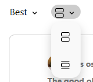

# Content CSS
#### Every class mentioned here can be find at src/Homepage/Components/Content/content.css

:::tip[Drop Down]




:::
```CSS
.choice-above-posts {
    padding: 50px;
    background-color: transparent;
    margin-top: -110px;
    margin-left: 260px;
    display: flex;
    align-items: center; /* Align items vertically */
    margin-bottom: 25px;
  }
  

  .content-sort-type {
    position: relative; /* Add this line */
    margin-left: 10px;
    display: flex;
    justify-content: center;
    align-items: center;
    border-radius: 50px;
    width: 70px;
    height: 28px;
  }
  
  .content-view-type {
    position: relative; /* Add this line */
    margin-left: 10px;
    display: flex;
    justify-content: center;
    align-items: center;
    border-radius: 50px;
    width: 50px;
    height: 24px;
  }
  
  .content-sort-type:hover,.content-view-type:hover {
    background-color: rgba(128, 128, 128, 0.4); 
    border-radius: 50px;
}
  .content-sort-type p {
    margin: 0;
  }


  .content-drop-down-list{
    border: none;
    background-color: transparent;
  }
  
  .options-content-sort-drop-down-list {
    position: absolute;
    background-color: #f9f9f9;
    min-width: 60px;
    box-shadow: 0px 8px 16px 0px rgba(0,0,0,0.2);
    z-index: 1;
    border-radius: 15px;
    top: calc(100% + 5px); /* Position dropdown below its parent button */
  }
  
  .options-content-view-drop-down-list {
    position: absolute;
    background-color: #f9f9f9;
    min-width: 50px;
    box-shadow: 0px 8px 16px 0px rgba(0,0,0,0.2);
    z-index: 1;
    border-radius: 15px;
    top: calc(100% + 5px); /* Position dropdown below its parent button */
  }
  
  

.options-content-sort-drop-down-list button ,.options-content-view-drop-down-list button{
    display: block;
    width: 100%;
    padding: 12px 16px;
    text-decoration: none;
    border: none;
    background: none;
    text-align: left;
    border-radius: 5px;
}

.options-content-sort-drop-down-list button:hover ,.options-content-view-drop-down-list button:hover{
    background-color: #ddd;
}
```
